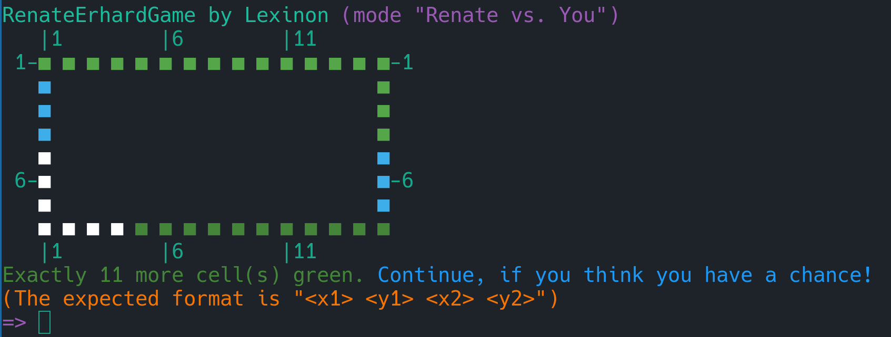

# RenateErhardGame

In the first round of the "Bundeswettbewerb Mathematik" (German Federal Mathematics Competition) of 2025, students were asked to solve (roughly) the following problem:

> For integers $m,n\geq3$, a $m\times n$ rectangular frame consists of the $2m+2n-4$ border squares of a rectangle divided in $m\times n$ squares. Renate and Erhard use such a $m\times n$ rectangular frame to play a game with the following rules (where Renates make the first move): The player whose turn it is colores a rectangular area consisting of at least one (previously) uncolored square of the rectangular frame. After the move, the uncolored squares still have to be coherent. The player that makes the last move wins. Determine the values of $m,n$ for which Renate has a winning strategy.

It can be shown that, in fact, for all $m,n\geq3$, Renate has a winning strategy (see [Solutions](https://www.mathe-wettbewerbe.de/fileadmin/Mathe-Wettbewerbe/Bundeswettbewerb_Mathematik/Dokumente/Aufgaben_und_Loesungen_BWM/2025/bwm_2025_i_version_homepage_2_2025_03_16.pdf) for the proof).

I decided to turn this hypothetical game into a Python 3 CLI application. Simply install the two dependencies with
```
python3 -m pip install --upgrade termcolor
python3 -m pip install --upgrade colorama
```
(or whatever package manager you use) and run `game.py` in the command line. Have fun!


